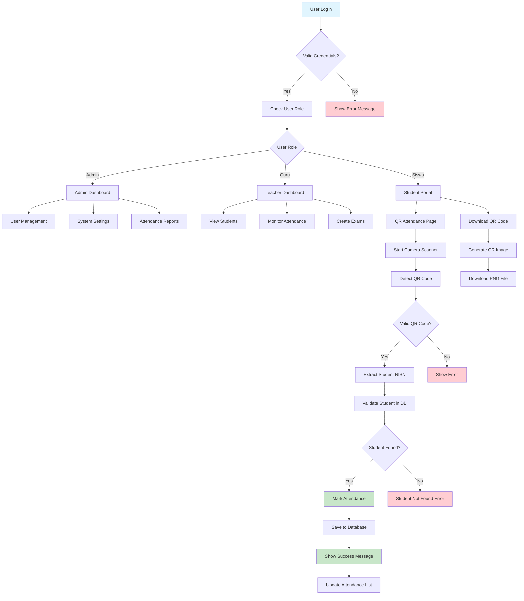
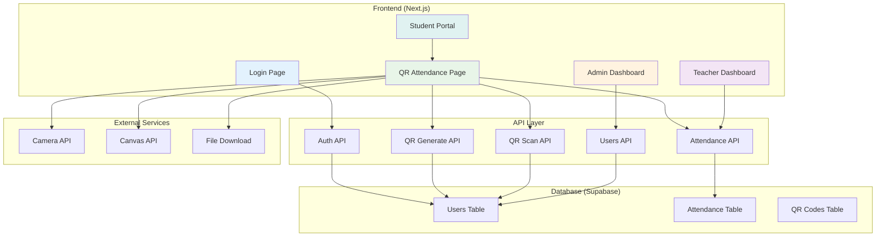

# QR Code Attendance System - Complete Flowchart

## System Overview
Sistem absensi modern menggunakan QR Code yang menggantikan face recognition untuk kemudahan dan kecepatan.

## Main Components

### 1. Authentication Flow
```
User Login
    ↓
Check Credentials (NISN/NIP/Email)
    ↓
Validate User Role (Admin/Guru/Siswa)
    ↓
Redirect to Dashboard
    ↓
Show Role-based Menu
```

### 2. QR Code Generation Flow
```
Student Data Request
    ↓
Fetch Student Info from Supabase
    ↓
Generate QR Data: "STUDENT_{NISN}"
    ↓
Create QR Code Image
    ↓
Download QR Code (PNG)
    ↓
Store QR Data in Database (Optional)
```

### 3. QR Code Scanning Flow
```
Camera Access Request
    ↓
Start QR Scanner
    ↓
Detect QR Code in Camera
    ↓
Extract Student NISN from QR Data
    ↓
Validate Student in Database
    ↓
Mark Attendance
    ↓
Update Attendance Records
    ↓
Show Success Notification
```

### 4. Attendance Management Flow
```
Attendance Request
    ↓
Check Existing Attendance Today
    ↓
Determine Status (Hadir/Terlambat)
    ↓
Save to Supabase Database
    ↓
Update Local Storage (Fallback)
    ↓
Return Success Response
```

## Database Schema

### Users Table
```sql
- id (UUID, Primary Key)
- nama (VARCHAR)
- nisn (VARCHAR, Unique)
- role (ENUM: admin, guru, siswa)
- class_name (VARCHAR)
- qr_code (VARCHAR, Optional)
- created_at (TIMESTAMP)
- updated_at (TIMESTAMP)
```

### Attendance Table
```sql
- id (UUID, Primary Key)
- user_id (UUID, Foreign Key)
- status (ENUM: hadir, terlambat, tidak_hadir)
- method (VARCHAR: qr_code, manual)
- waktu_masuk (TIMESTAMP)
- created_at (TIMESTAMP)
```

## API Endpoints

### Authentication
- `POST /api/auth/login` - User login

### QR Code System
- `GET /api/qr/generate?studentId={id}` - Generate QR code
- `POST /api/qr/scan` - Process scanned QR code

### Attendance
- `GET /api/attendance/list` - Get attendance records
- `POST /api/attendance/mark` - Mark attendance

### Users
- `GET /api/users/list` - Get user list

## User Roles & Permissions

### Admin
- Full system access
- User management
- System settings
- Attendance reports
- QR code management

### Guru (Teacher)
- View student data
- Monitor attendance
- Create exams
- View reports
- Access QR scanner

### Siswa (Student)
- View own attendance
- Download personal QR code
- Use QR attendance
- View announcements

## Technology Stack

### Frontend
- Next.js 14 (React)
- TypeScript
- Tailwind CSS
- Lucide React Icons
- Custom QR Components

### Backend
- Next.js API Routes
- Supabase (Database)
- Canvas API (QR Generation)

### Database
- PostgreSQL (via Supabase)
- Real-time subscriptions
- Row Level Security (RLS)

## Security Features

### QR Code Security
- Unique student identification
- NISN-based validation
- Time-based attendance limits
- Duplicate prevention

### Data Protection
- HTTPS enforcement
- Input validation
- SQL injection prevention
- XSS protection

## Error Handling

### Camera Access
- Permission denied → Show instructions
- No camera found → Suggest alternatives
- Camera in use → Wait or retry

### QR Code Issues
- Invalid format → Show error message
- Student not found → Log and notify
- Database error → Use fallback

### Network Issues
- API timeout → Use localStorage fallback
- Connection lost → Retry mechanism
- Server error → Show user-friendly message

## Performance Optimizations

### QR Code Generation
- Client-side generation
- Cached student data
- Optimized canvas rendering

### Database Queries
- Indexed NISN field
- Efficient joins
- Pagination for large datasets

### Frontend
- Lazy loading components
- Optimized images
- Minimal re-renders

## Mobile Responsiveness

### QR Scanner
- Responsive camera view
- Touch-friendly controls
- Portrait/landscape support

### UI Components
- Mobile-first design
- Flexible grid layouts
- Readable typography

## Deployment Architecture

```
Frontend (Vercel/Netlify)
    ↓
API Routes (Next.js)
    ↓
Database (Supabase)
    ↓
CDN (Static Assets)
```

## Monitoring & Analytics

### Attendance Tracking
- Real-time attendance count
- Daily/weekly/monthly reports
- Student attendance patterns

### System Health
- API response times
- Database performance
- Error rates
- User activity logs

## Future Enhancements

### Planned Features
- Bulk QR code generation
- Attendance export (PDF/Excel)
- Advanced reporting
- Mobile app version
- Offline support

### Technical Improvements
- Real-time notifications
- Advanced analytics
- Machine learning insights
- Multi-language support

## Troubleshooting Guide

### Common Issues
1. **QR Code not scanning**
   - Check camera permissions
   - Ensure good lighting
   - Verify QR code quality

2. **Attendance not saving**
   - Check internet connection
   - Verify student exists in database
   - Check API logs

3. **Camera not working**
   - Use HTTPS
   - Allow camera permissions
   - Try different browser

### Debug Steps
1. Check browser console for errors
2. Verify API responses
3. Check database connectivity
4. Test with different devices

## System Benefits

### For Students
- Quick and easy attendance
- No need for special devices
- Personal QR code ownership
- Real-time attendance tracking

### For Teachers
- Simplified attendance management
- Real-time student status
- Reduced administrative work
- Better data accuracy

### For Administrators
- Complete system overview
- Detailed reporting
- User management
- System monitoring

## Conclusion

The QR Code Attendance System provides a modern, efficient, and user-friendly solution for school attendance management. It replaces the complex face recognition system with a simpler, more reliable QR code approach that works across all devices and platforms.

The system is designed to be:
- **Simple**: Easy to use for all user types
- **Fast**: Quick attendance marking
- **Reliable**: Consistent performance
- **Secure**: Protected data and access
- **Scalable**: Can handle growing user base
- **Maintainable**: Clean, documented code

---

## Mermaid Flowchart



## System Architecture Diagram

